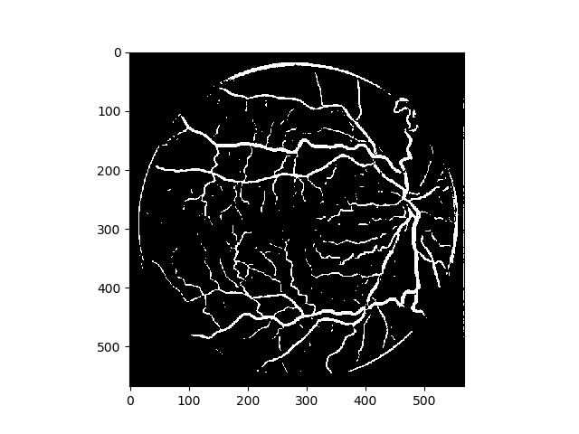
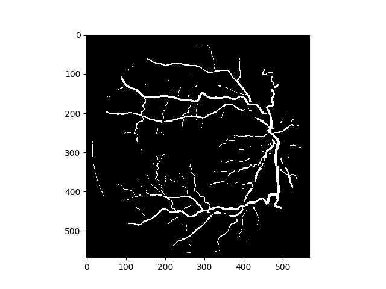

# Retina-Unet-Pytorch
A Pytorch implement of retina vessel segementation

## Dataset
DRIVE dataset is provided in ./data directory

## Networks
I define 3 types of unet model in the ./models directory
- **original_unet**: implemented as the essay describe
- **net2**: add padding for convolution/deconvolution kernels in order to maintain input shape
- **net_improve**: add batch_normalization for each layer to converge faster

## Loading Data
Data Prefetcher is used to boost loading speed.
Here I set patch_per_img = 19000, so loading with cpu can be very slow.

## Usage

## Some results

